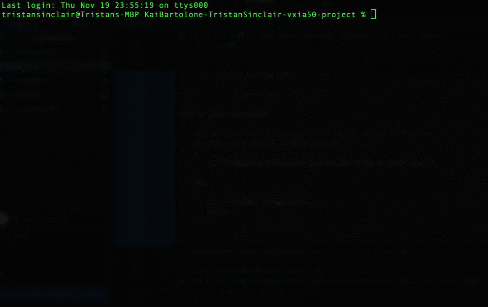
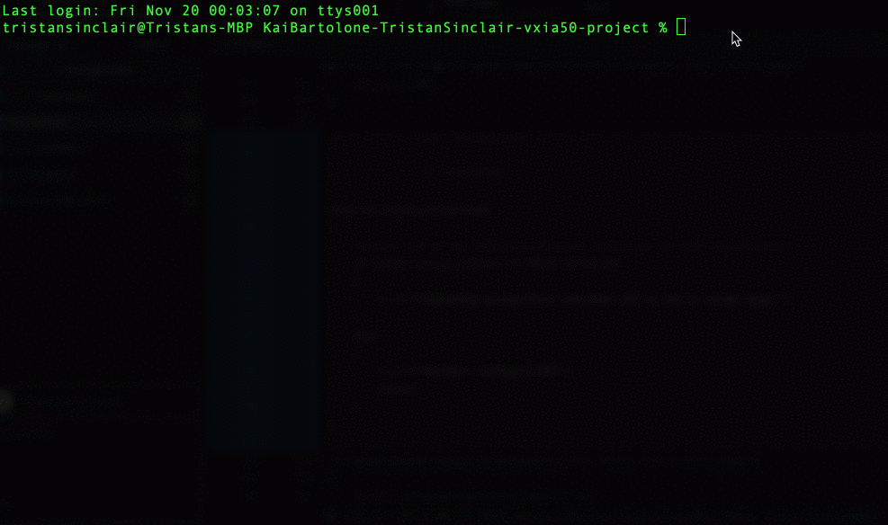
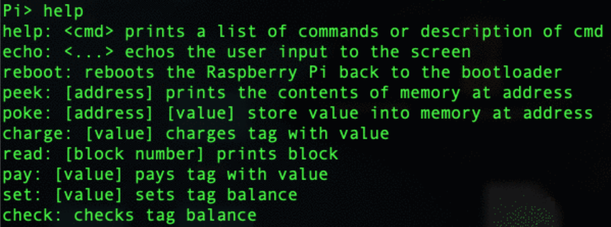
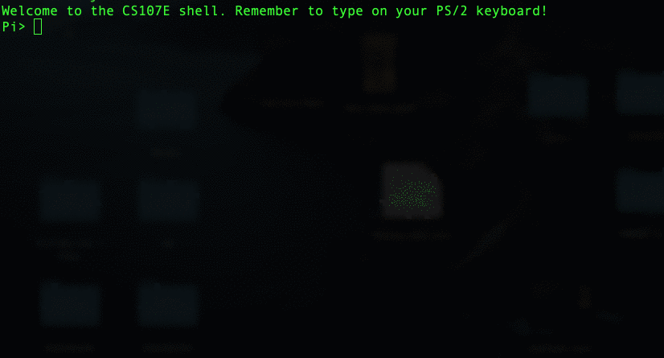

# **PayPi**
## Kai Bartolone - Vincent Xia - Tristan Sinclair
___

## **Project Description**
This app uses the pn532 NFC sensor to simulate a payment system with nfc tags. Using the console, a user can charge, pay, set, and check the balance that is on an nfc tag. Users can also get a printout of block information on the nfc tag.
___
## **Member contribution**
Everyone did a little bit of everything!

___
## **References**
[Waveshare Wiki PN532 NFC HAT](https://www.waveshare.com/wiki/PN532_NFC_HAT)

___
## **Self-evaluation**
We were able to execute the proposal very well for the time span that we had. We are particularly proud of the debugging process that went into getting the pn532 sensor to work. Initially, we could not get spi communication to work with the pn532, but using the logic analyzer we were able to make connections between the byte level communications and the protocol. These situations that needed the logic analyzer happened often, and we were able to overcome faulty wirings, faulty cables, and confusing protocols. In addition to the Mifare tag protocol, something that was interesting to learn was the redundancy that was embedded into the communication systems. For example, the spi communication protocol checks the status of the pn532 multiple times in every data transaction in addition to sending an acknowledgement of the pn532 receiving a command.

___
## **Images**

To begin our project we started with the goal of preparing the SPI module to be used to communicate with the pn532 module. Our first test was to send a request to the module and ask for a response that was to include the firmware version of the module.

First challenge... communicate with the pn532 module via SPI!

___
Our next challenge was to communicate with the module to search for and return data from an NFC tag. We began by requesting the UID from the card.

UID data from an NFC tag

___
Our final challenge was to prepare the NFC tags hold the data we wanted. We assigned an area of the data 4 bytes in order to hold an int value. This value was written and read from in order to hold a "balance".

Reading and writing to a balance stored on the NFC tag
___
We put it all together into shell commands to be used by the user.

___
Here's a gif of the shell in action being used to read and write to an NFC tag!

___